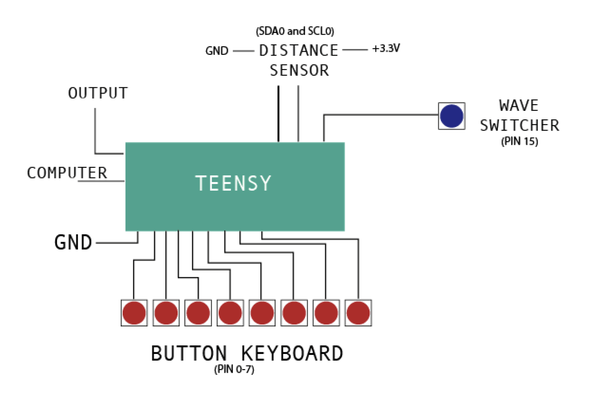
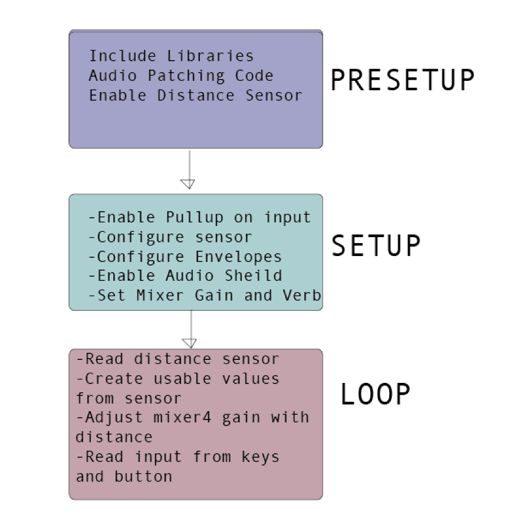
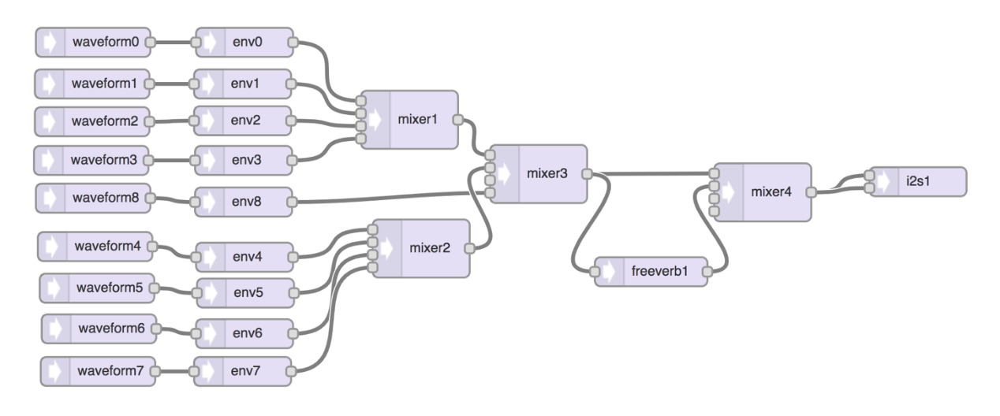

# Polyphonic Teensy Synthesizer with Distance Controlled Effects

## Introduction
This synthesizer is Teensy written in Arduino code. It can be played like a keyboard and utilizes 9 voice polyphony across a major scale. It has reverb controlled by a distance sensor and allows for the played wave type to be switched between a sine wave, sawtooth wave, triangle wave, and square wave. This synthesizer serves as a good introduction to the musical possibilities that can be implemented with the Teensy audio board, Arduino code, and some simple electronic hardware.

## Methods and Design
### Hardware

This synthesizer consists of 9 momentary push button switches, an ST VL53L0X distance sensor, a Teensy 3.2, and the Teensy audio adapter board. 8 of the push buttons are used for the playing keys of the synth and are connected to digital pins 0 through 7. The 9th button is connected to digital pin 15 and allows the user to switch between the waveforms played by the synth. While the buttons only use one pin, the distance sensor uses two: the SCL0 pin, connected to the SCL pin on the distance sensor, and the SDA0 pin, connected to the SDA pin on the sensor. The SCL line is the clock line and is responsible for synchronizing all of the data transfer between the teensy and the sensor. The SDA is the line that actually transfers the data and allows for communication between the sensor and the teensy. The distance sensor also is connected to +3.3V and ground. The function of the distance sensor in this synthesizer is to control the amount of reverb to be mixed in with the direct sound from the synth. For example, as your hand gets closer to the sensor, the amount of reverb will increase.

### Code

**Introduction**

While the hardware setup is crucial to allowing user control over the synth, the actual functionality of the synth is within the Arduino code. The code component of this project can be broken up into three main components: The pre – setup, the setup, and the loop section.

**Pre-Setup**

In the pre-setup, I started out by including all of the tools and libraries I would need. Some of these include Audio, Wire, SPI, SD, SerialFlash, Bounce, and the distance sensor library “AdaFruit_VL53L0X”. From there, I setup the audio patching using the Teensy audio system design tool:

This design consists 9 waveforms to generate 9 voice polyphony and 9 envelopes to make each of the voices have smooth attacks and releases to avoid clicks when keys are pressed. There are also three mixers to combine all of the voices to a single output line. Then there is a fourth mixer to control the amount of direct sound from the waveforms, and the amount of reverb. This reverb takes the synth voices as an input and outputs the wet reverb signal to mixer 4. Finally, the output of mixer 4 goes to the left and right channels of the i2s1. Also in the pre-setup, the waveforms are put into an array called “waves” allowing the synth to cycle through the voices and enabling polyphony. This section also includes arrays for the different wave types, and array of notes for a major scale, and implementing bounce on each of the pins. 

**Setup**

After the pre-setup, the setup section is responsible for doing the rest of the one-time operations. Serial begins, and each of the button pins are configured to have the input pullups on. The next step is to enable the audio and set the volume level of the audio shield. Then, the distance sensor is configured to pull up, and the attack, decay, sustain, and release is set for each of the envelopes. The mixer4 gain is set defaulting to zero reverb, and the room size of the reverb is configured. Lastly, the int wType is defined and will be used to index through the different wave types, and the distance variables are defined to manipulate the data coming in from the distance sensor. 

**Loop**

All of the repetitive tasks of the code are within the loop section. These tasks include reading the distance sensor, reading the inputs from the keys, and doing something based on the inputs. The loop starts off by reading the distance sensor. The input provided from the sensor is the number of millimeters an object is from the device. After the distance sensor is read, the input is manipulated to return zero if the distance is less than 30 mm, and to return 300 if the distance is greater than 300 mm. Then this distance is subtracted from 300 and divided by 300 in order to normalize the input and have the number increase as an object gets closer to the sensor. As this input will be used to control the amount of reverb, it is useful to have the value only range from zero to one and increase as distance from the sensor decreases. This distance value is used to control the gain of input one on mixer4, which corresponds to the reverb amount.

Next, the wave switching button is read only if the button is pressed. If the button is pressed and there is a falling edge, wType is incremented unless it is already at the highest index value in the wave type list, in which case it is reset to zero. This allows for the wave type to be changed every time the button is pressed. 

Lastly, there is a loop to check if the buttons controlling the keys of the synth are pressed. If these buttons are pressed, the notes are played. Each note corresponds to one key on the major scale. Additionally, the waves array is cycled through each time a button is pressed and detected to have a falling edge. This allows for 9 voice polyphony.  I had a lot of help from my professor Jonathan Newport with this polyphony section. Finally, the notes are turned off If there is a rising edge detected so that they don’t sustain when your finger is released from the button.